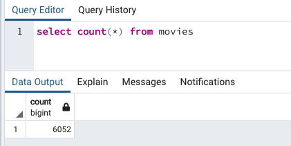
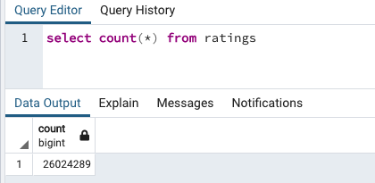

# Amazing Prime Video Hackathon Databases

Amazing Prime Video (APV) is the most popular video streaming service. APV wants to devlop an algortihm to predict which low budget movie will become popular, so APV can then buy the streaming rights. 

APV has decided to sponsor a hackathon to help their team and inspire those in the coding community. Working with an APV team member, the goal of this project is to help build and create the datasets that will be provided to those participating in the hackathon.

The datasets for this project are coming from two sources:
* Wikipedia
* Movie Lands

The Wikipedia source is a scrape of the website of all movies since 1990. The Movie Lands source is a collection of rating data.

Using these two sources, the team created two databases using the ETL method using Python for all steps in the process. In the end, the hackathon contestants will be able to use two SQL databases, Movies and Ratings, to help them with their alogrithm building.

The images below are the sizes of each respective database the hackathon members will have to work with.

